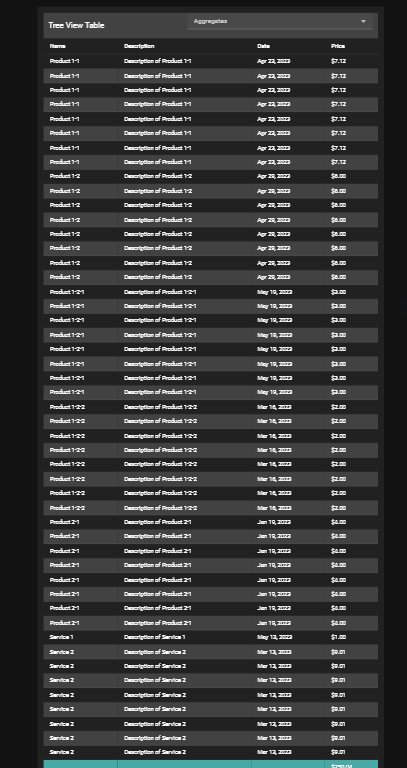
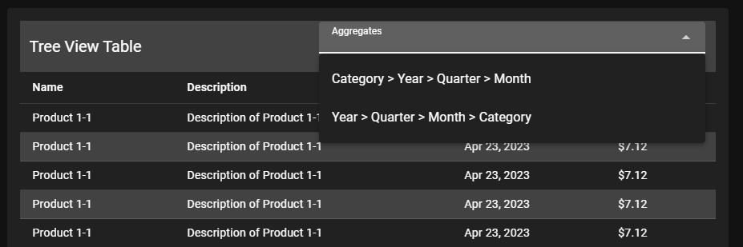
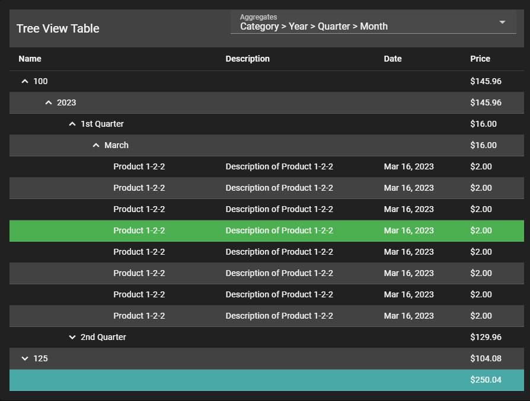
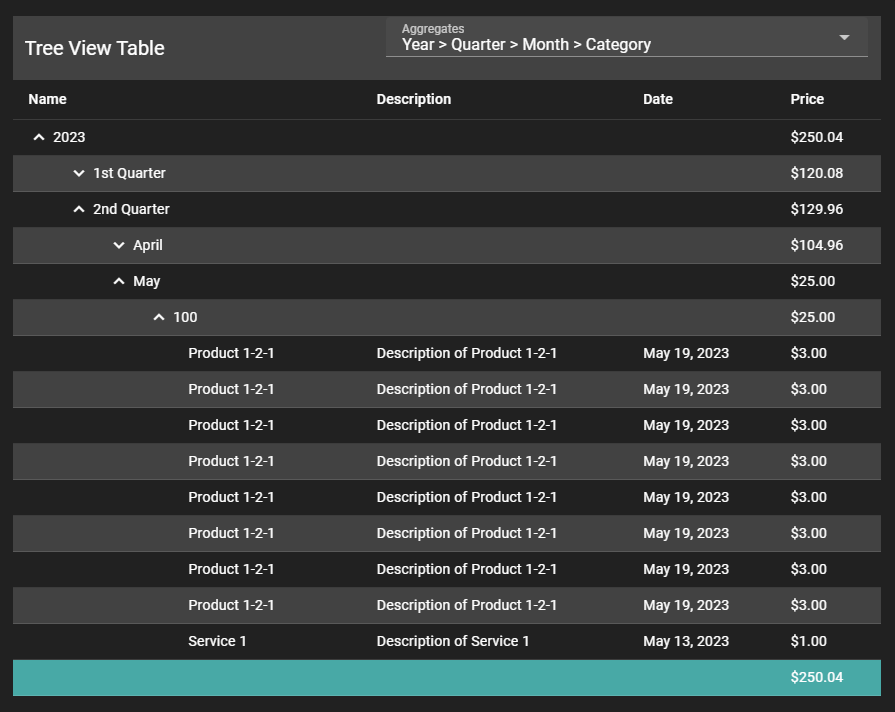

# TreeView Table

This project is created using Vuetify 3 ["_check the installation_"](https://vuetifyjs.com/en/getting-started/installation/)

# Screenshots

Data without aggregation/Grouping:

Multiple aggergations can be set for the table treeview

Example of when data is aggregated in a treeview:

Example 2 of treeview table:

